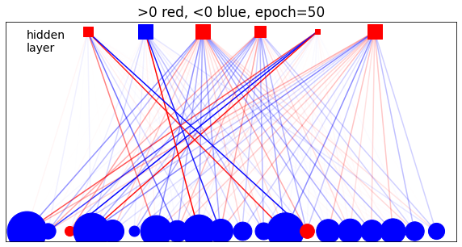
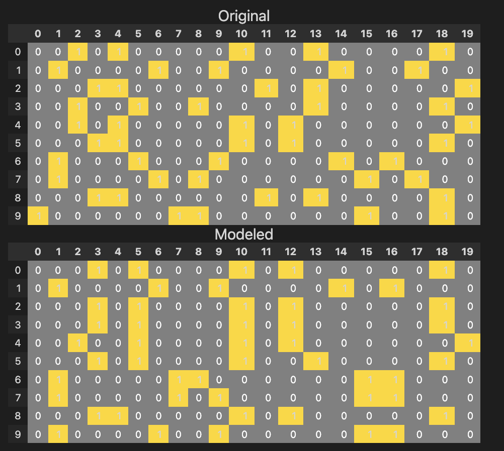
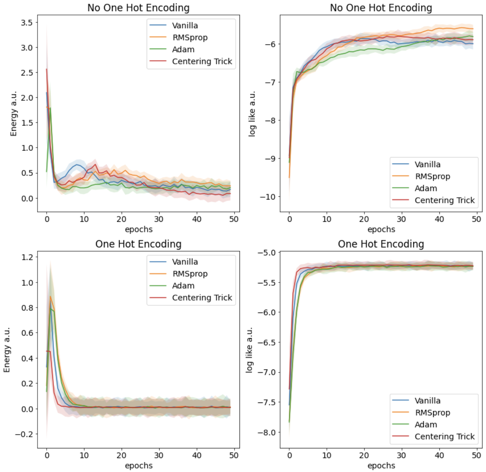

# 🧠 Restricted Boltzmann Machines  

---

## 📝 Overview
- Implementation from scratch of a RBM to generate and denoise one-hot-enoded sequences of proteins 

---

## 🗂️ Repository Structure
- RBM.ipynb contains the dataset import, the model definition and training
- DATA_b directory contains the dataset at different level of noise

--- 

## 📊 Results

  
*Representation of the RBM weights after training*

 
*On top: noised data. Below: denoised data*

   
*Energy and Log-Likelihood evolution during training*

